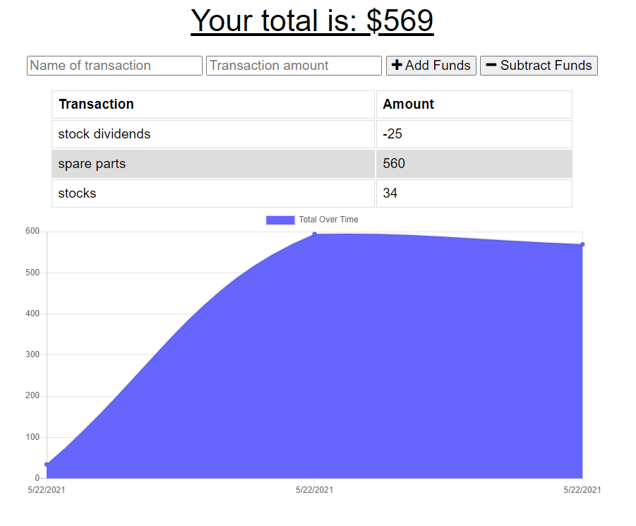

# Progressive Budget

  

  ## Description 
  
  This application is a Progressive Budget Tracker deployed in the cloud using Heroku. It enables the user to track travel expenses with or without internet connection. This offers the advantage of tracking ones budget and expenditures while travelling.

  
  ## Table of Contents
  
  * [Installation](#installation)
  * [Usage](#usage)
  * [License](#license)
  * [Contributing](#contributing)
  * [Tests](#tests)
  * [Questions](#questions)
  
  
  ## Installation
  
  The project requires that express and mongoose be installed in the local machine. Several npm packages were also required to run the application. Front End application was done using Vanilla Javascipt while ExpressJS and MongoDB forms the Back End.

  Nodemon was also installed as development dependency.
  
  
  ## Usage 
  
  The following image snapshots the functionality of the app.

  

  
  The application could be accessed using the following heroku link:

  https://am-budget-tracker.herokuapp.com/

  The repository for this application could be accessed using the following github link:

  https://github.com/apolinar1607/Online-Offline-Budget-Trackers.git

  
  
  ## License
  
  Licensed by : [Apache](./utils/license-Apache)
  
  
  ## Contributing
  
  Not applicable.
  
  ## Tests

  To run the application locally, type 'npm run watch' or 'npm start' in the command line inside the folder containing the server.js file.
  
  To deploy it automatically, use the heroku link provided above.

  ## Questions
  
  Github Username: 
  [apolinar1607](https://github.com/apolinar1607)

  Please send me an email if you have any question(s): 
  apolinar.magtanong@gmail.com
  
  

  ---
  © 2021 JM Automation . All Rights Reserved.

